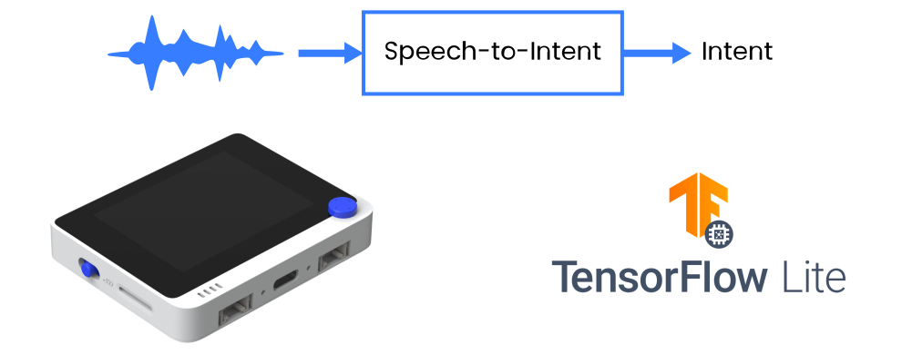

# Speech-to-Intent-Micro

<p align="center">

</p>


An open-source, easily accessible package for training and deploying Speech-to-Intent models on microcontrollers and SBCs. Speech-to-Intent models transform speech (either as raw waveform or processed features, e.g. MFCC used for reference implementation) to parsed output, for example:

**Utterance: "Turn on the lights in the kitchen"**

```Result:
{
    Intent: "activate",
    Slot1: "lights",
    Slot2: "kitchen"
}
```

or 

**Utterance: "Stop the music"**

```Result:
{
    Intent: "deactivate",
    Slot1: "music",
    Slot2: "none"
}
```

<p align="center">

</p>

SLU offers a middle ground between Large-vocabulary continuous speech recognition (LVCSR) models (which are too heavy to be run on microcontrollers and other resource-constrained environments) and keyword spotting models (which do not scale well to large vocabularies). 
The reference plain Convolutional 2D model trained on FLUENT Speech commands dataset achieves 87.5 % intent and slot accuracy and has the size of 29 kb after INT8 quantization.

## Train

Download FLUENT Speech commands dataset from https://www.kaggle.com/tommyngx/fluent-speech-corpus. Unzip the archive and place the .csv files to data/csv/ directory, speakers folder to data/wavs folder. 

If you are using your own dataset, make sure it follows the FLUENT Speech commands dataset convention - nin particular, that "path", "transcription", "action", "object", "location" columns are present in dataset .csv file. 

Then you can run the training either with interactive notebook located in jupyter_notebooks/speech_to_intent_tf_keras.ipynb or by executing train.py file inside repository. 

```
usage: train.py [-h] [-t TRAIN_DATASET_PATH] [-v VALID_DATASET_PATH] [-m MODEL_TYPE] [-b BATCH_SIZE] [-l LR] [-e EPOCHS] [-d GENERATE_DATA]
                [--sampling_rate SAMPLING_RATE] [--min_freq MIN_FREQ] [--max_freq MAX_FREQ] [--win_size_ms WIN_SIZE_MS] [--num_cepstral NUM_CEPSTRAL]

Train and validate Speech to Intent model on FLUENT Speech Commands-like dataset

optional arguments:
  -h, --help            show this help message and exit
  -t TRAIN_DATASET_PATH, --train_dataset_path TRAIN_DATASET_PATH
                        path to train data .csv file
  -v VALID_DATASET_PATH, --valid_dataset_path VALID_DATASET_PATH
                        path to validation data .csv file
  -m MODEL_TYPE, --model_type MODEL_TYPE
                        type of model to train: plain_Conv2D, DW_Conv2D, res_Conv2D
  -b BATCH_SIZE, --batch_size BATCH_SIZE
                        Batch size for training and validation
  -l LR, --lr LR        Initial learning rate
  -e EPOCHS, --epochs EPOCHS
                        Number of epochs to train
  -d GENERATE_DATA, --generate_data GENERATE_DATA
                        Whether or not to re-generate intents and slots data
  --sampling_rate SAMPLING_RATE
                        Audio sampling rate
  --min_freq MIN_FREQ   Spectrogram minimum frequency
  --max_freq MAX_FREQ   Spectrogram maximum frequency
  --win_size_ms WIN_SIZE_MS
                        Spectrogram window size
  --num_cepstral NUM_CEPSTRAL
                        Number of MFCC cepstral coefficients
```

Example usage:
```
python train.py --epochs 50 --generate_data True
```

After training is finished the lowest validation loss model for the training session is automatically converted to INT8 quantized .tflite model and its binary representation in .h file.

## Test

You can test one model or all the model in the folder with test.py to determine intent and slot accuracy. 
**Make sure to run it with slot2ids and intent2ids pkl files and audio processing parameters used during the model training.**
```
usage: test.py [-h] [-v TEST_DATASET_PATH] [--model_path MODEL_PATH] [--model_folder_path MODEL_FOLDER_PATH] [-b BATCH_SIZE] [--min_accuracy MIN_ACCURACY]
               [--sampling_rate SAMPLING_RATE] [--min_freq MIN_FREQ] [--max_freq MAX_FREQ] [--win_size_ms WIN_SIZE_MS] [--num_cepstral NUM_CEPSTRAL]

Test Speech to Intent model on FLUENT Speech Commands-like dataset

optional arguments:
  -h, --help            show this help message and exit
  -v TEST_DATASET_PATH, --test_dataset_path TEST_DATASET_PATH
                        path to validation data .csv file
  --model_path MODEL_PATH
                        path to model .h5 file
  --model_folder_path MODEL_FOLDER_PATH
                        path to directory with .h5 model files
  -b BATCH_SIZE, --batch_size BATCH_SIZE
                        Batch size for training and validation
  --min_accuracy MIN_ACCURACY
                        Minimum accuracy to display test results
  --sampling_rate SAMPLING_RATE
                        Audio sampling rate
  --min_freq MIN_FREQ   Spectrogram minimum frequency
  --max_freq MAX_FREQ   Spectrogram maximum frequency
  --win_size_ms WIN_SIZE_MS
                        Spectrogram window size
  --num_cepstral NUM_CEPSTRAL
                        Number of MFCC cepstral coefficients
```

Example usage:
```
python test.py --model_path checkpoints/2021-08-31_14-27-51/slu_model.h5 --test_dataset_path data/csv/wt_data.csv

```

## Infer

You can run inference on a single .wav file with infer.py script - that can be useful for sanity check or as a starting point for developing standalone Python application.

**Make sure to run it with slot2ids and intent2ids pkl files and audio processing parameters used during the model training.**

```
usage: infer.py [-h] [-w WAV_FILE] [--model_path MODEL_PATH] [--sampling_rate SAMPLING_RATE] [--min_freq MIN_FREQ] [--max_freq MAX_FREQ] [--win_size_ms WIN_SIZE_MS]
                [--num_cepstral NUM_CEPSTRAL]

Run inference on single .wav file

optional arguments:
  -h, --help            show this help message and exit
  -w WAV_FILE, --wav_file WAV_FILE
                        path to file
  --model_path MODEL_PATH
                        path to model .h5 file
  --sampling_rate SAMPLING_RATE
                        Audio sampling rate
  --min_freq MIN_FREQ   Spectrogram minimum frequency
  --max_freq MAX_FREQ   Spectrogram maximum frequency
  --win_size_ms WIN_SIZE_MS
                        Spectrogram window size
  --num_cepstral NUM_CEPSTRAL
                        Number of MFCC cepstral coefficients

```

Example usage:
```
python infer.py --model_path checkpoints/2021-08-31_14-27-51/slu_model.h5 --wav_file data/wavs/wt_test/turn_on_the_lights_in_the_kitchen_wt.wav

```

## Deploy to Edge Device

There is readily available Arduino code for running inference with Wio Terminal built-in microphone, using DMA ADC and CMSIS-DSP for MFCC calculation. To use your own model, copy .h5 file with model weights, change its name here
```
  model = tflite::GetModel(checkpoints_2021_08_20_18_02_16_slu_model_tflite);
```
compile and upload. Press the Wio Terminal C button to start the sound recording for 3 seconds - the inference results will be displayed on the screen.

**Make sure to run it with slot2ids and intent2ids pkl files and audio processing parameters used during the model training.**

## TO-DO

There is an extensive list of things that can be made better in this package. If you are interested in implementing some of the below features or others, don't hesitate to fork the repository and make PR with changes!

- [ ] Example code for Arduino Nano 33 BLE Sense
- [ ] Example code for Raspberry Pi
- [ ] Batch testing
- [ ] Thorough testing of Depthwise and Residual Convolutional feature extractors
- [ ] LSTM support
- [ ] Seq2seq model architecture (a la Listen, Spell, Attend)
- [ ] Model pre-training
- [ ] Guide to using synthetic data
- [ ] Automatic RAM usage estimation